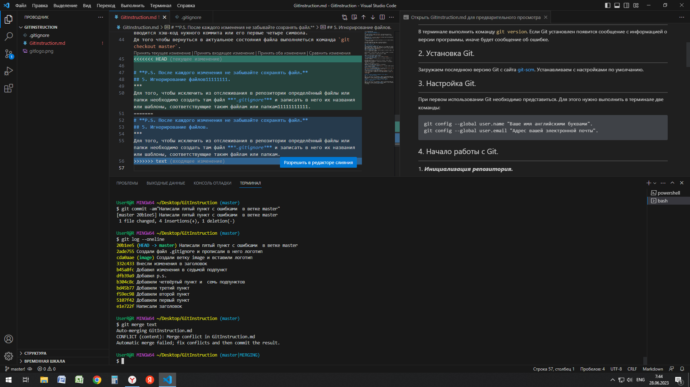

# **Инструкция для Git и Github.**
## 1. Проверка наличия установленного Git.
***
В терминале выполнить команду `git version`. Если Git установлен появится сообщение с информацией о версии программы, иначе будет сообщение об ошибке.
## 2. Установка Git.
***
Загружаем последнюю версию Git с сайта [git-scm](https://git-scm.com/downloads). Устанавливаем с настройками по умолчанию.
## 3. Настройка Git.
***
При первом использовании Git необходимо представиться. Для этого нужно выполнить в терминале две команды:
```
git config --global user.name "Ваше имя английскими буквами".
git config --global user.email "Адрес вашей электронной почты".
```
## 4. Начало работы с Git.
***
### 1. ***Инициализация репозитория.***
Для начала необходимо инициализировать репозиторий, то есть указать Git в какой папке мы будем хранить и редактировать наши файлы. Это нужно для того чтобы Git мог отслеживать изменения в наших файлах. Для этого в меню открываем необходимую папку. В терминале вводим команду `git init`.
### 2. ***Добавление файлов.***
Для того чтобы Git начал отслеживать нужные нам файлы, их неободимо добавить. Для этого в терминале вводим команду:
```
git add name.md - команда добавляет файл, где "name.md" имя файла с расширением.
или
git add . - команда добавляет все файлы находящиеся в папке.  
```
Данные команды подготавливают файл к фиксации.
### 3. ***Проверка статуса репозитория.***
Просмотреть статус нужного репозитория можно командой `git status`.
### 4. ***Внесение изменений.***
При редактировании файлов необходимо фиксировать изменения. Выполняеться это следующими командами:
```
git commit -m "комментарий" - команда фиксирует изменения в данном файле и позволяет написать комментарий.
git commit -a -m "комментарий" - команда фиксирует изменения во всех файлах в репозитории с комментарием.
```
Фиксация изменений называеться "коммит".
Используя второй вариант команду `git add` можно упразднить.
### 5. ***Просмотр изменений до коммита.***
Просмотр изменений производится командой `git diff`. Отображаться будут изменения не подготовленные к фиксации.
### 6. ***Просмотр списка изменения.***
Для просмотра списка наших изменений (коммитов) служит команда `git log` или `git log --oneline` - выводит упрощённый список в одну строку.
### 7. ***Перемещение по версиям файла.***
Для перемещения по версиям файла служит команда `git checkout`, после команды вводится хэш-код нужного коммита или его первые четыре символа.
Дя того чтобы вернуться в актуальное состояния файла выполняеться команда `git checkout master`.
## **P.S. После каждого изменения не забывайте сохранять файл.**
## 5. Игнорирование файлов.
***
Для того, чтобы исключить из отслеживания в репозитории определённый файлы или папки необходимо создать там файл ***.gitignore*** и записать в него их названия или шаблоны, соответствующие таким файлам или папкам.
## 6. Работа с ветками в Git.
***
### 1. ***Просмотр списка веток.***
Список веток в репозитории можно посмотреть с помощью команды `git branch`.
### 2. ***Создание веток.***
Создать ветку можно командами:
```
git branch <имя ветки> - создаём ветку.
git checkout -b <имя ветки> - создаём ветку с переходом на неё.
```
По умолчанию имя основной ветки в Git - *master*.
### 3. ***Переход между ветками***
Для переключения между ветками используются команды:
```
git checkout <имя ветки>.
git switch <имя ветки>.
Эти команды равнозначны друг другу.
```
### 4. ***Слияние веток и разрешение конфликтов***
Слияние (объединение) веток выполняется командой `git merge <имя ветки>`.
Для этого необходимо перейти на ветку в которую мы хотим добавить изменения и слить её с нужной нам веткой.
### **Конфликт и его разрешение.**
При слиянии веток может возникнуть конфликт. Конфликт возникает если в разных ветках на одних и техже строчках разная информация. При возникновении конфликта Visual Studio Code предлагает варианты его разрешения. Выбираем тот вариант который нам подходит. После разрешения конфликта и слияния веток необходимо сделать коммит.
#### **Пример конфликта.**

### 5. ***Удаление веток***
Удаление веток производиться командами:
```
git branch -d <имя ветки> - удаляем слитую ветку, тоесть ветку прошедшую объединение.
git branch -D <имя ветки> - удаляем не слитую ветку. Параметр -D выполняет принудительное удаление.
```
 